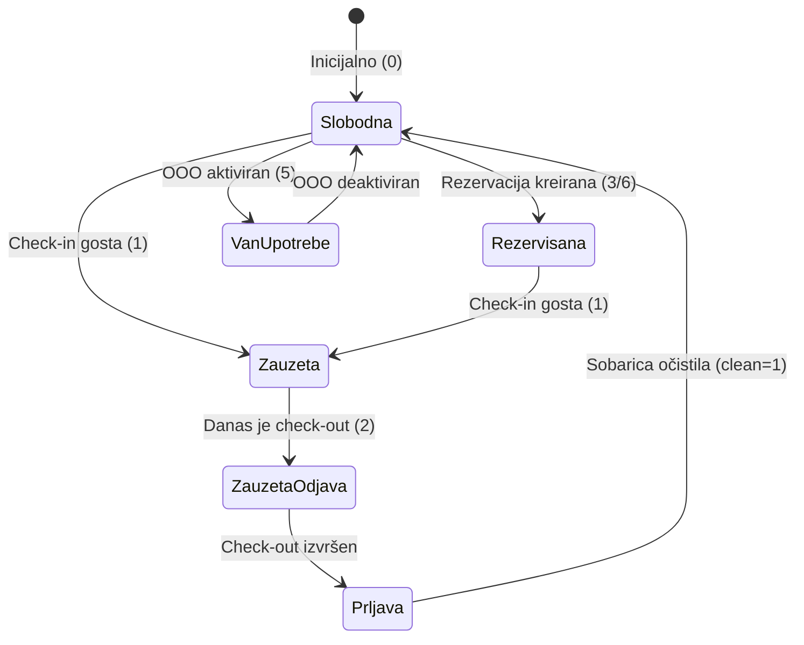

# FSD 04: Sobe i Kapaciteti

## Status analize
- **Fajlovi za analizu:** `frmSobe.vb`, `frmSobaInfo.vb`, `frmSobaInfoPromjena.vb`, `ModuleKod.vb`
- **Tabele za analizu:** `sobe`, `sobavrsta`, `zgrade`, `sobatarifa`, `sobasadrzaji`, `relgostsoba`
- **Status:** AUTHORITATIVE
- **Analizirao:** 2026-05-15 - Antigravity (Claude Sonnet 3.5)

## 1. Pregled modula
Ovaj modul upravlja fizičkim kapacitetima hotela. Omogućava vizuelni pregled statusa svih soba u realnom vremenu (slobodna, zauzeta, rezervisana, van upotrebe, prljava). Takođe upravlja kategorizacijom soba (tipovi), rasporedom po zgradama/spratovima, te definisanjem osnovnih tarifa i sadržaja soba.

## 2. Workflow dijagrami

### 2.1 Životni ciklus statusa sobe

## 3. Entiteti i tabele (legacy → novi)

| Legacy (MySQL) | Opis | Novi entitet (PostgreSQL) | Napomena |
|:---|:---|:---|:---|
| `sobe` | Osnovni podaci o sobi | `Room` | Dodati UUID, audit polja |
| `sobavrsta` | Tipovi soba (jednokrevetna, itd.) | `RoomType` | `brojKreveta` je ključno polje |
| `zgrade` | Objekti u sklopu hotela | `Building` | |
| `sobatarifa` | Cenovnici/Tarife | `Tariff` | Sadrži `uslov` (string logika?) |
| `sobasadrzaji` | Dodatna oprema/usluge u sobi | `Amenity` | |
| `relgostsoba` | Veza gosta i sobe (Check-in) | `RoomAssignment` | Ključna za status |
| `logcont` | Logovi pristupa (RFID/Kontroleri) | `AccessLog` | Povezano preko `idkon` |

### 3.1 Detalji tabele `sobe`
- `ooo`: (tinyint) 1 = Out of Order, 0 = Active
- `clean`: (tinyint) 1 = Clean, 0 = Dirty
- `idkon`: ID hardverskog kontrolera za pristup sobi
- `vrsta`: FK na `sobavrsta`
- `zgradaID`: FK na `zgrade`
- `ooo` + `razlog`: Opis zašto soba nije u funkciji

## 4. Poslovna pravila (Business Rules)

### 4.1 Logika statusa sobe (`fnSobaStatus`)
Sistem izračunava status sobe na osnovu tabele `relgostsoba` i polja `ooo`:
- **Status 0 (Slobodna)**: Nema aktivnih gostiju (`odjavljen=0`).
- **Status 1 (Zauzeta)**: Postoji gost, datum odlaska je u budućnosti.
- **Status 2 (Zauzeta/Odjava)**: Postoji gost, datum odlaska je danas ili je prošao.
- **Status 3 (Rezervisana/Potvrđena)**: Postoji rezervacija, polje `rezervP=1`.
- **Status 4 (Rezervisana i Zauzeta)**: Gost je unutra, ali postoji i potvrđena rezervacija (verovatno za isti dan kasnije?).
- **Status 5 (Van upotrebe)**: Polje `ooo=1` u tabeli `sobe`.
- **Status 6 (Rezervisana/Nepotvrđena)**: Postoji rezervacija, polje `rezervP=0`.

### 4.2 Čišćenje soba
- Prilikom check-outa (iz `frmPlacanje.vb`), soba se automatski postavlja na `clean = 0`.
- Soba ostaje u statusu "Prljava" dok se ručno ne promeni na `clean = 1`.

### 4.3 SOS i Fire Alarm
- Postoji vizuelna indikacija u `frmSobe.vb` (Timer1) koja menja `BackgroundImage` dugmeta sobe ako su polja `sos` ili `vatr` postavljena na 1 u datasetu (povezano sa IoT/kontrolerom).

### 4.4 Praćenje pristupa (Access Control)
- Sistem beleži svaki ulazak u sobu putem RFID kartica u tabelu `logcont`.
- U `frmSobaistorija.vb` moguće je videti istoriju otključavanja sobe povezano sa ID-om kontrolera (`idkon`).

## 5. Edge case-ovi i posebni slučajevi
- **Status 4**: "Rezervisana i zauzeta" sugeriše da sistem dozvoljava preklapanje ili pripremu za dolazak novog gosta dok je stari još tu.
- **Dva ista naziva sobe**: U SQL dumpu vidimo dve sobe sa nazivom '201' (id 3 i 4). Potrebno proveriti da li je to greška u podacima ili dozvoljen scenario (npr. različite zgrade).
- **Virtualne sobe (`sobev`)**: Postoji tabela `sobev` koja je prazna u dumpu, ali sugeriše "View" ili privremene sobe za kalkulacije.

## 6. Otvorena pitanja
- **OQ-01-001**: Šta tačno predstavlja polje `ooo` (skraćenica)? Pretpostavka je "Out Of Order".
- **OQ-01-002**: Tabela `sobavrsta1` — zašto postoji duplikat tabele tipova soba? Da li se koristi za različite cenovnike ili periode?
- **OQ-01-003**: Kako se tačno `clean` status vraća na 1? Nisam našao direktan UI kod u `frmSobarice.vb`. Postoji li poseban panel za sobarice?

## 7. Preporuke za novi sistem
- Implementirati pravi državni automat (State Machine) za statuse soba umjesto kompleksnih SQL funkcija.
- Objediniti `ooo` i `clean` u jedinstven statusni model sobe.
- Koristiti web-sockets za real-time update SOS i Fire alarma umjesto tajmera koji polluje bazu svake sekunde.
