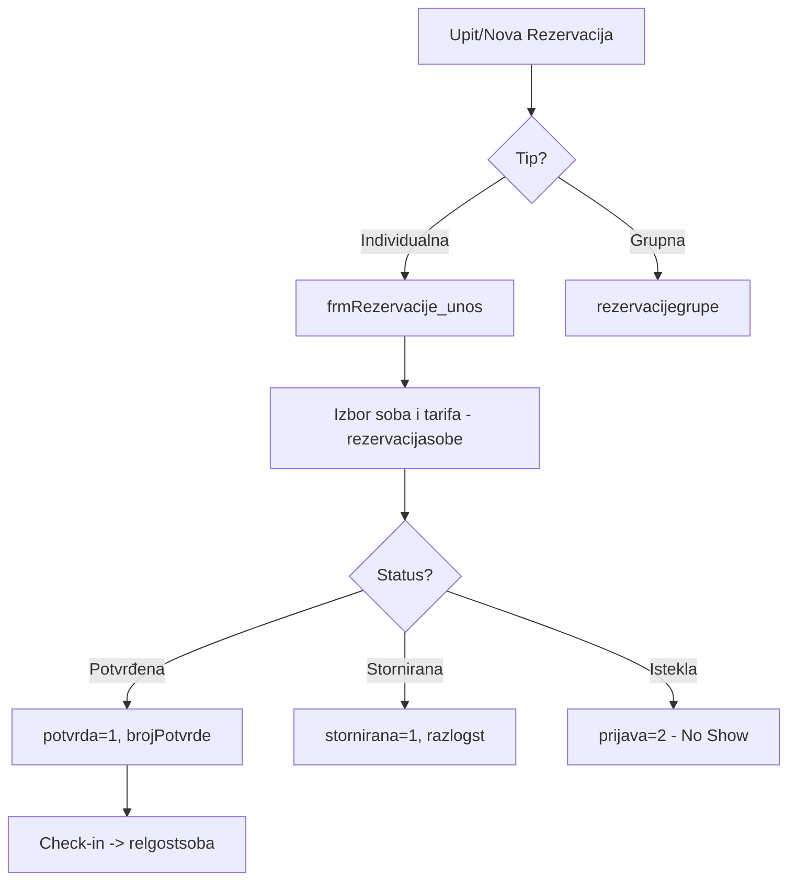

# FSD 05: Rezervacije (PMS Core)

## Status analize
- **Fajlovi za analizu:** `frmRezervacije.vb`, `frmRezervacije_unos.vb`, `frmRezervacijeNove.vb`, `frmRezervacijePregled.vb`, `frmRezervacijePrebaci.vb`
- **Tabele za analizu:** `rezervacije`, `rezervacije1`, `rezervacijegrupe`, `rezervacijasobe`, `rezervacijasobe1`, `rezervacijaprijava`, `rezervacijeizvor`, `rezervacijetip`, `relgostsoba`
- **Status:** AUTHORITATIVE
- **Analizirao:** 2026-05-15 - Antigravity (Claude Sonnet 3.5)

## 1. Pregled modula
Rezervacije su "srce" PMS (Property Management System) aplikacije. Ovaj modul upravlja kompletnim životnim ciklusom bukinga: od upita i unosa rezervacije, preko potvrde/uplate avansa, do konverzije u check-in (prijava gosta). Sistem podržava individualne i grupne rezervacije, te dodjelu više soba jednoj rezervaciji.

## 2. Workflow dijagrami

### 2.1 Životni ciklus rezervacije


## 3. Entiteti i tabele (legacy → novi)

| Legacy (MySQL) | Opis | Novi entitet (PostgreSQL) | Napomena |
|:---|:---|:---|:---|
| `rezervacije` | Glavna tabela rezervacija | `Booking` | |
| `rezervacijasobe` | Sobe dodijeljene rezervaciji | `BookingRoom` | Omogućava M:N vezu |
| `rezervacijegrupe` | Grupni bukinzi | `GroupBooking` | |
| `rezervacijeizvor` | Izvor (Direct, Booking.com, itd.) | `BookingSource` | |
| `rezervacijetip` | Tip (Garantovana, Opcija, itd.) | `BookingType` | |
| `rezervacije1` | Arhiva/History rezervacija | `BookingHistory` | Provjeriti zašto je odvojena |

### 3.1 Detalji tabele `rezervacije`
- `potvrda`: (tinyint) 1 = Potvrđena, 0 = Upit.
- `stornirana`: (tinyint) 1 = Otkazana.
- `prijava`: 0 = Čeka, 1 = Prijavljen (Gost je u hotelu), 2 = No-Show.
- `alarmid`: Veza sa sistemom podsjetnika (npr. "Pozvati gosta za potvrdu").

## 4. Poslovna pravila (Business Rules)

### 4.1 Automatsko otkazivanje (No-Show)
- Prilikom učitavanja modula, sistem automatski postavlja `prijava=2` za sve rezervacije čiji je `checkInDate` manji od jučerašnjeg dana, a gost se nije pojavio.

### 4.2 Više soba po rezervaciji
- Jedna rezervacija (`rezervacije.id`) može imati više povezanih zapisa u `rezervacijasobe`. Svaka soba može imati svoju specifičnu tarifu i gosta.

### 4.3 Potvrda i Storno
- Potvrda generiše `brojPotvrde` i beleži datum potvrde.
- Storno zahteva `razlogst` (razlog storna) i beleži datum storna.

### 4.4 Konverzija u Check-in
- Kada se rezervacija označi kao "Prijava", podaci se migriraju/povezuju sa tabelom `relgostsoba`.

## 5. Edge case-ovi i posebni slučajevi
- **Prebacivanje soba**: `frmRezervacijePrebaci.vb` sugeriše da je česta potreba premještanje gosta iz jedne sobe u drugu unutar istog bukinga.
- **Staging tabele**: Postojanje `rezervacije1` i `rezervacijasobe1` sugeriše da sistem čuva verzije ili istoriju promjena podataka.
- **Kontakt podaci**: Rezervacija čuva set kontakt podataka (ime, tel, mob, fax, email) koji mogu biti različiti od podataka samog gosta.

## 6. Otvorena pitanja
- **OQ-03-001**: Razlika između `rezervacije` i `rezervacije1`. Da li je to arhiva ili "draft" sistem?
- **OQ-03-002**: Kako sistem rešava overbooking? Postoji li hard-lock na sobu u momentu unosa rezervacije?
- **OQ-03-003**: `blokID` u tabeli `rezervacije` - da li se odnosi na blokiranje sobe za prodaju?

## 6. Performanse Gantt prikaza

Legacy Gantt ucitava do 86 kolona (dana) × N soba u jedan DataGridView. Novi sistem mora koristiti virtuelizaciju.

```javascript
// Frontend: horizontalna virtuelizacija (react-virtualized)
<AutoSizer>
  {({ height, width }) => (
    <Grid
      columnCount={dateRange}
      columnWidth={80}
      height={height}
      rowCount={rooms.length}
      rowHeight={40}
      width={width}
      overscanColumnCount={14}  // 2 sedmice u oba smjera
    >
      {renderCell}
    </Grid>
  )}
</AutoSizer>
```

Backend: paginirani API umjesto jednog ogromnog upita.
```
GET /api/bookings/gantt?from=2026-05-01&to=2026-06-01&page=1&pageSize=50
```

## 6. Grupne rezervacije (Group Booking)

### 6.1 Blokiranje soba
Grupa rezervise N soba, ali se konkretne sobe dodjeljuju tek pri check-inu.

```json
{
  "groupId": "uuid-blok-1",
  "name": "Vjencanje Ivanovic",
  "type": "WEDDING",
  "totalRooms": 15,
  "roomsByType": { "DELUXE": 10, "SUITE": 5 },
  "checkIn": "2026-06-15",
  "checkOut": "2026-06-17",
  "releaseDate": "2026-06-12",     // neotpustene sobe se oslobadjaju 3 dana prije
  "specialRate": { "discountPercent": 15 },
  "masterBill": {
    "guestId": "uuid-mladenac",
    "covers": ["accommodation", "breakfast"]
  },
  "guests": [
    { "name": "Marko Markovic", "roomType": "DELUXE" },
    { "name": "Ana Anic", "roomType": "SUITE" }
  ]
}
```

### 6.2 Master racun
Jedna osoba (ili agencija) placa za sve. Ostali gosti ne dobijaju racun za nocenje, samo za licne troskove (minibar, telefon).

```csharp
public class GroupBillingService
{
    public async Task<Invoice> GenerateMasterInvoice(Guid groupId)
    {
        var group = await _groupRepo.GetWithRoomsAsync(groupId);

        // 1. Saberi sva nocenja na master racun
        var invoice = new Invoice();
        foreach (var room in group.Rooms)
        {
            invoice.AddItem(new InvoiceItem
            {
                Description = $"Nocenje - {room.RoomName}",
                Amount = room.NightTotal,
                Payee = group.MasterGuestId   // ide na mladence, ne na gosta
            });
        }

        // 2. Licni troskovi ostaju na gostima
        return invoice;
    }
}
```

### 6.3 API

| Endpoint | Opis |
|----------|------|
| `POST /api/groups` | Kreiraj grupu |
| `GET /api/groups/{id}` | Detalji grupe |
| `PUT /api/groups/{id}` | Izmjena bloka |
| `POST /api/groups/{id}/release` | Otpusti nepotvrdjene sobe |
| `GET /api/groups/{id}/master-bill` | Master racun |
| `GET /api/groups/{id}/guest-list` | Lista gostiju za check-in |

## 7. Preporuke za novi sistem
- **Real-time Availability**: Implementirati locking mehanizam koji sprečava double-booking u milisekundi.
- **Integracija sa Channel Managerom**: Novi sistem mora imati API za sinhronizaciju sa spoljnim izvorima (Booking.com, Expedia).
- **Automatski No-Show**: Premjestiti logiku automatskog otkazivanja na pozadinski worker (Background Service) umjesto da se okida pri otvaranju forme.
- **Unified Guest History**: Prilikom unosa rezervacije, odmah pretraživati CRM profil gosta iz Modula 2.
