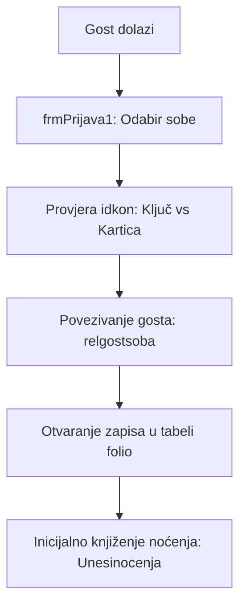
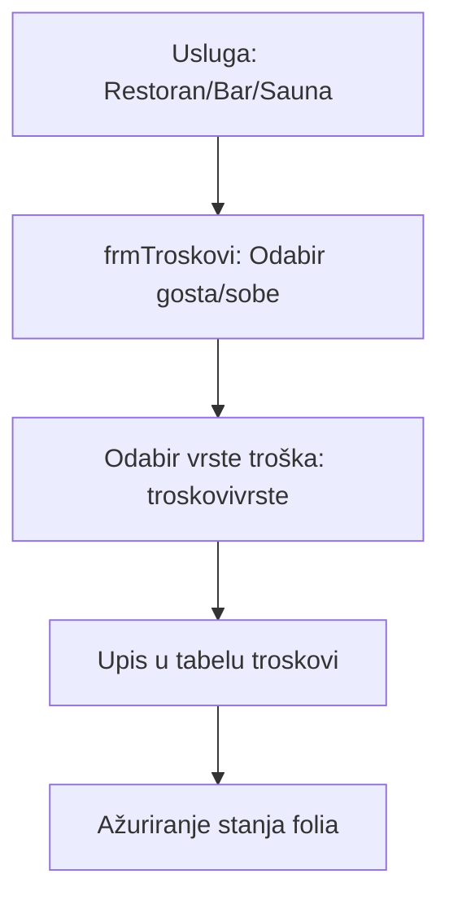

# FSD 06: Recepcija i Folio

## Status analize
- **Fajlovi za analizu:** `frmPrijava1.vb`, `frmOdjava1.vb`, `frmTroskovi.vb`, `frmTroskoviNoc.vb`
- **Tabele za analizu:** `folio`, `nocenja`, `troskovi`, `troskovipojedinacni`, `troskovisuma`, `troskovivrste`, `posjetafolio`, `neplaceni`
- **Status:** AUTHORITATIVE
- **Analizirao:** 2026-05-15 - Antigravity (Claude Sonnet 3.5)

## 1. Pregled modula
Modul Recepcija i Folio upravlja operativnim boravkom gosta od momenta ulaska u sobu (Check-in) do momenta pripreme za odlazak (Check-out). Ključna funkcija je vođenje "Folio" kartice (računa gosta) na koju se automatski ili ručno knjiže noćenja i dodatni troškovi (restoran, bar, telefon, itd.).

## 2. Workflow dijagrami

### 2.1 Proces prijave i otvaranja folia

### 2.2 Knjiženje troškova

## 3. Entiteti i tabele (legacy → novi)

| Legacy (MySQL) | Opis | Novi entitet (PostgreSQL) | Napomena |
|:---|:---|:---|:---|
| `folio` | Status računa sobe | `Folio` | Povezano sa boravkom |
| `nocenja` | Dnevnik noćenja po gostu | `StayNight` | |
| `troskovi` | Svi nefakturisani troškovi | `Charge` | |
| `troskovivrste` | Katalog usluga hotela | `ServiceCatalog` | |
| `neplaceni` | Evidencija duga (Open Folios) | `OutstandingBalance` | |

### 3.1 Detalji tabele `nocenja`
- `RID`: FK na `relgostsoba` (Identifikuje konkretan boravak).
- `Tarifa`: Iznos noćenja (može varirati po danu).
- `PrijavaOdjava`: Flag (0=Noćenje, 1=Prijava?). U kodu se najčešće koristi 0.
- `popust`: Individualni popust na to noćenje.

### 3.2 Detalji tabele `troskovi`
- `TID`: FK na `troskovivrste` (Tip usluge).
- `zaklj`: (tinyint) 1 = Trošak je ušao u račun, 0 = Još uvek je "otvoren" na foliu.
- `iznos`: Ukupna vrednost (kolicina * cena).

## 4. Poslovna pravila (Business Rules)

### 4.1 Generisanje noćenja (`Unesinocenja`)
- Sistem ne koristi automatizovani "Night Audit" u pozadini, već se noćenja generišu prilikom prijave ili ručnim okidanjem iz `frmTroskoviNoc`.
- Procedura `Unesinocenja` prvo briše postojeći zapis za taj dan i gosta, pa upisuje novi (prevencija dupliranja).

### 4.2 Late Check-out logika
- U `frmOdjava1` postoji logika koja proverava vreme (sat). Ako je check-out nakon 12:00, sistem može prilagoditi datum noćenja ili dodati dodatni trošak (potrebna potvrda biznis pravila).

### 4.3 Folio po sobi vs Folio po gostu
- Iako su troškovi vezani za gosta (`GSID`), `folio` tabela je vezana za sobu (`SID`). To sugeriše da hotel primarno prati troškove "po sobi", a onda ih deli na goste prilikom plaćanja.

## 5. Edge case-ovi i posebni slučajevi
- **Djelimično plaćanje**: Polje `Djelimicno` u tabeli `troskovi` sugeriše da se jedan trošak može podeliti na više računa.
- **Zaključavanje folia**: Polje `zakljucen` u `folio` tabeli sprečava dodavanje novih troškova nakon što je račun pripremljen.
- **Senzori i IoT**: `frmPrijava1` menja ikonicu ključa/kartice na osnovu `idkon` polja, što je direktna veza sa Modulom 1.

## 6. Otvorena pitanja
- **OQ-04-001**: Da li se noćenja automatski generišu u ponoć (background task) ili recepcija mora pokrenuti proces?
- **OQ-04-002**: Šta predstavlja `posjetafolio`? Da li je to istorijski arhiv zatvorenih folia?
- **OQ-04-003**: Kako se rešava "Transfer troška" (npr. iz restorana na sobu 201)? Postoji li integracija sa POS sistemom?

## 7. Preporuke za novi sistem
- **Automated Night Audit**: Uvesti standardni Night Audit proces koji se izvršava u određeno vreme i "zaključava" prethodni dan.
- **Sub-Folios**: Omogućiti više folia po jednom boravku (npr. jedan za firmu - noćenje, drugi za gosta lično - mini bar).
- **Audit Log**: Svaka izmena u troškovima mora biti logovana (ko je izmenio iznos i kada).
- **Real-time Folio View**: Omogućiti gostu da vidi svoje trenutno stanje putem QR koda/aplikacije.
