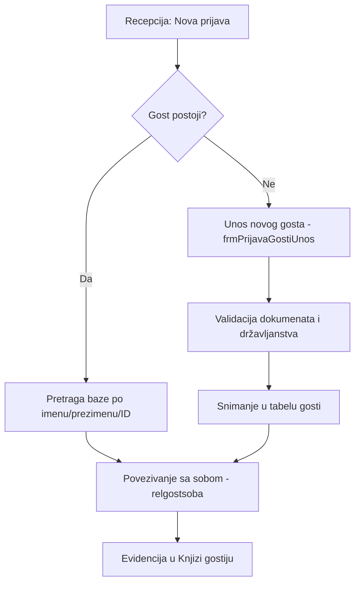

# FSD 07: Gosti i CRM

## Status analize
- **Fajlovi za analizu:** `frmGosti.vb`, `frmPrijavaGostiUnos.vb`, `frmPrijavaGostiKucice.vb`, `frmPartneri.vb`
- **Tabele za analizu:** `gosti`, `gostdokument`, `gostipid`, `partneri`, `drzave`, `komercijalista`
- **Status:** AUTHORITATIVE
- **Analizirao:** 2026-05-15 - Antigravity (Claude Sonnet 3.5)

## 1. Pregled modula
Ovaj modul upravlja bazom podataka gostiju i poslovnih partnera (agencija, firmi). Omogućava unos ličnih podataka gostiju, skeniranje dokumenata (evidenciju broja i tipa), te upravljanje komercijalnim uslovima za partnere (popusti, odgođeno plaćanje). Modul je direktno povezan sa procesom prijave (check-in) i obračunom boravišnih taksi.

## 2. Workflow dijagrami

### 2.1 Proces unosa gosta i prijave


## 3. Entiteti i tabele (legacy → novi)

| Legacy (MySQL) | Opis | Novi entitet (PostgreSQL) | Napomena |
|:---|:---|:---|:---|
| `gosti` | Glavna tabela sa ličnim podacima | `Guest` | Dodati polja za saglasnost (GDPR) |
| `gostdokument` | Tipovi dokumenata (Pasoš, Lična...) | `DocumentType` | |
| `drzave` | Šifarnik država | `Country` | Koristiti ISO kodove |
| `partneri` | Pravna lica (agencije, firme) | `Partner` / `Company` | |
| `komercijalista` | Komercijalisti koji dovode goste | `SalesAgent` | Za praćenje provizija |
| `gostipid` | Pomoćna tabela za aktivne prijave | `GuestCheckIn` | Povezano sa `relgostsoba` |

### 3.1 Detalji tabele `gosti`
- `DID`: FK na `drzave` (Državljanstvo).
- `Rid`: ID trenutne ili poslednje relacije (vezano za `relgostsoba`).
- `dokument`: Tip dokumenta (1=Pasos, 2=Licna...).
- `brDokument`: String polje za broj dokumenta.

### 3.2 Detalji tabele `partneri`
- `pdv` i `idd`: Identifikacioni brojevi za fakturisanje.
- `rabat`: Procenat popusta dogovoren sa partnerom.
- `brdanodg`: Broj dana odloženog plaćanja (valuta).

## 4. Poslovna pravila (Business Rules)

### 4.1 Registracija dokumenata
- Sistem zahteva unos tipa dokumenta i broja dokumenta za sve strane državljane (zakonska obaveza prijave strancima).
- Državljanstvo (`drzavljanstvo`) utiče na obračun boravišne takse (domaći vs strani).

### 4.2 Partneri i Agencije
- Ako je gost "Agencijski", plaćanje se često vrši preko partnera (Virmansko plaćanje).
- Partneri imaju definisane rabate koji se automatski primenjuju prilikom kreiranja računa.

### 4.3 OCR skeniranje dokumenata
Hotel posjeduje OCR skener koji očitava MRZ (Machine Readable Zone) sa pasoša i ličnih karata. MRZ tekst se automatski parsira i popunjava formu:

```javascript
// MRZ parser (radi na frontendu, bez dodatnih biblioteka)
function parseMrz(rawText) {
  const lines = rawText.trim().split('\n');
  if (lines[0].startsWith('P<')) { /* pasos TD3 */ }
  if (/\d{6}<{2}/.test(lines[0])) { /* licna karta TD1 */ }
}
```

Podržani formati:
- **Pasoš (TD3)**: 2 linije, 44 karaktera
- **Lična karta (TD1)**: 3 linije, 30 karaktera

Backend validira: MRZ checksum, punoljetnost (>18), istek dokumenta.

### 4.4 Pretraga gostiju
- Sistem omogućava pretragu po više kriterijuma: Ime, Prezime, Broj dokumenta ili ID.
- Prilikom unosa, sistem pokušava automatski da predloži postojećeg gosta kako bi se izbegli duplikati (CRM istorija).

## 5. Edge case-ovi i posebni slučajevi
- **Gost bez dokumenata**: U nekim hitnim slučajevima dozvoljen unos (verovatno "Ostalo" tip dokumenta).
- **Grupe gostiju**: Povezivanje više gostiju pod jedan `grupaID` u `relgostsoba`.
- **Komercijalisti**: Praćenje koji gost je došao preko kog komercijaliste (field `komercijalista` u tabeli gosti ili partneri?).

## 6. Rije�ene nedoumice

### OQ-02-002: gostipid
Potrebno provjeriti u legacy source kodu da li se `gostipid` koristi u funkcijama, reportima ili stored procedurama. Ako se ne koristi nigdje osim kao tabela, onda je interna �ifra (sistemski ID za aktivne prijave).### OQ-02-003: Fotografije i skenovi dokumenata
Konfigurabilno u admin konzoli (Settings ? Documents ? Storage):
- Lokalni fajl sistem (default za in-house)
- S3 / DigitalOcean Spaces (default za cloud)
Izbor zavisi od zakonskog okvira u dr�avi gdje se aplikacija koristi (GDPR, zakon o za�titi podataka).### GDPR
- **Export format**: Konfigurabilno u admin konzoli (PDF, JSON, XML � svi podr�ani)
- **Brisanje**: Prilagoditi lokalnim zakonima i propisima (default: anonimizacija licnih podataka, cuvanje finansijskih)
- **Rok cuvanja**: Prilagoditi lokalnim zakonima i propisima (default: 3 godine za licne, 10 za finansijske)## 7. Preporuke za novi sistem
- **GDPR usklađenost**: Obavezno uvođenje logovanja pristupa ličnim podacima i polja za saglasnost.
- **OCR Integracija**: Integracija sa čitačima pasoša za brži check-in.
- **Unified Profile**: Objedinjavanje istorije boravka, preferencija (npr. "ne pušač") i troškova na nivou jednog `Guest` profila.
- **Partner Portal**: Mogućnost da partneri sami unose svoje goste ili rezervacije.
