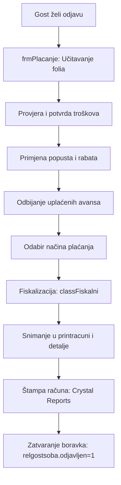

# FSD 08: Naplata i Fakturisanje (Billing & Invoicing)

## Status analize
- **Fajlovi za analizu:** `frmPlacanje.vb`, `frmRacuni.vb`, `frmFiskalni.vb`, `classFiskalni.vb`, `frmPredracun.vb`
- **Tabele za analizu:** `printracuni`, `printracunidetalji`, `printracunifooter`, `printracuniavans`, `fiskalni`, `placanje`, `placanjedetalji`, `nplac`
- **Status:** AUTHORITATIVE
- **Analizirao:** 2026-05-15 - Antigravity (Claude Sonnet 3.5)

## 1. Pregled modula
Ovaj modul je najkritičniji dio sistema jer upravlja finansijskim transakcijama, fiskalizacijom i izdavanjem računa. On integriše podatke o noćenjima (Modul 4), troškovima (Modul 4) i avansima kako bi generisao finalni obračun za gosta ili agenciju. Podržava različite načine plaćanja (Gotovina, Kartica, Virman) i storiranje pogrešnih računa.

## 2. Workflow dijagrami

### 2.1 Proces izdavanja računa na odlasku


## 3. Entiteti i tabele (legacy → novi)

| Legacy (MySQL) | Opis | Novi entitet (PostgreSQL) | Napomena |
|:---|:---|:---|:---|
| `printracuni` | Zaglavlje računa | `Invoice` | |
| `printracunidetalji` | Stavke na računu | `InvoiceItem` | |
| `printracuniavans` | Evidencija avansnih uplata | `Prepayment` | |
| `nplac` | Šifarnik načina plaćanja | `PaymentMethod` | |
| `printracunifooter` | Ukupni iznosi i porezi | `InvoiceSummary` | |

### 3.1 Detalji tabele `printracunidetalji`
- **Čuvanje iznosa**: Koriste se `char(10)` polja (`CijBezPdv`, `Ukupno`) umjesto numeričkih tipova, što zahtijeva konverziju u kodu (`CDec`, `Val`).
- **Porezi**: Polje `Pdv` čuva stopu, a `IznosPdv` obračunatu vrijednost poreza za tu stavku.

### 3.2 Detalji tabele `printracuni`
- `fisrac`: Broj fiskalnog isječka (veza sa fiskalnim printerom).
- `storno`: Flag (1 = račun je storniran).
- `Ime` i `DrugoIme`: Ime gosta i podaci o firmi (naziv, adresa, ID broj).

## 4. Poslovna pravila (Business Rules)

### 4.1 Fiskalizacija
- Sistem šalje komande fiskalnom uređaju putem `classFiskalni.vb`. Tek nakon potvrde od uređaja, račun se smatra validnim u bazi.
- Podržava različite protokole za fiskalne printere (vjerovatno Tring, HCP ili slični popularni u regiji).

### 4.2 Obrada avansa
- Avans uplaćen ranije (npr. pri rezervaciji) se oduzima od ukupnog iznosa. Sistem mora generisati "Storno avansa" ili "Konačni račun sa odbitkom avansa" u skladu sa poreskim propisima.

### 4.3 Grupni računi
- Omogućava kreiranje jednog računa za više soba ili gostiju (npr. za agencije/grupe). U bazi se to vezuje preko `grupaID`.

### 4.4 Valute i Kursna lista
- Računi se mogu pripremiti u stranoj valuti, ali se fiskalizacija vrši u lokalnoj valuti po važećem kursu iz `kursna` tabele.

## 5. Edge case-ovi i posebni slučajevi
- **Storniranje računa**: Prilikom storna, sistem mora stornirati i pripadajuće stavke i fiskalni isječak.
- **Reprint računa**: Sistem omogućava ponovnu štampu računa iz arhive (`frmRacuni.vb`), ali bez ponovne fiskalizacije (koristi se sačuvani `fisrac`).
- **Promjena načina plaćanja**: Ako je račun već fiskalizovan, promjena zahtijeva storno i izdavanje novog računa.

## 6. Otvorena pitanja (rije�ena)

### OQ-05-001: Fiskalni uredaji
Sve je definisano u legacy kodu (Tring, NSC, HCP protokoli � vidi RE_05). Ne mijenja se nacin rada, samo se podaci preusmjeravaju kroz bridge.

### OQ-05-002: Virman
Ceka odluku.

### OQ-05-003: PDF kopija racuna
Ceka odluku.

### POS integracija (T9.5)
Konfiguracija POS sistema i Tring fiskalnog drivera je vec definisana u legacy kodu. Ne mijenja se � novi sistem samo preuzima podatke iz postojece konfiguracije.

## 7. POS integracija (restoran/bar)

Povezivanje sa eksternim POS sistemima (Pixel, Ontech, Loco) za automatsko knjizenje troskova na folio gosta.

### 7.1 Webhook endpoint

```csharp
[HttpPost("api/folio/charge-from-pos")]
public async Task<IActionResult> ChargeFromPos([FromBody] PosCharge request)
{
    var assignment = await _assignmentRepo
        .FindActiveByRoomAsync(request.RoomNumber);
    if (assignment == null) return NotFound("Soba nije zauzeta");

    foreach (var item in request.Items)
    {
        await _expenseRepo.AddAsync(new Expense
        {
            SID = assignment.RoomId,
            GSID = assignment.Id,
            TID = MapPosToExpenseType(item.Category),
            Iznos = item.Total,
            Kolicina = item.Quantity,
            Napomena = $"{request.PosName}: {item.Name}",
            RadnikID = ResolveEmployee(request.Operator),
            Zaklj = 0
        });
    }

    await _notificationService.FolioUpdatedAsync(assignment.RoomId);
    return Ok(new { folioTotal = await _folioRepo.CalculateTotalAsync(assignment.PID) });
}
```

### 7.2 Signature
```
Header: X-POS-Signature: sha256(body + sharedSecret)
Header: X-POS-Source: pixel|ontech|loco
```

### 7.3 Mapiranje kategorija

| POS kategorija | TID | Naziv troška |
|---------------|-----|--------------|
| RESTAURANT_MAIN | 3 | Restoran |
| BAR | 4 | Bar |
| ROOM_SERVICE | 6 | Room service |
| SPA | 7 | Spa |
| LAUNDRY | 8 | Veš |
| MINIBAR | 10 | Mini bar |

## 8. Preporuke za novi sistem
- **Numerička preciznost**: Koristiti `decimal` ili `money` tipove podataka u bazi za sve finansijske iznose umjesto `varchar/char`.
- **E-Fiskalizacija**: Integracija sa modernim servisima za online fiskalizaciju (REST API).
- **Multiple VAT Rates**: Podrška za različite stope poreza (npr. 17% za usluge, 5% za određene robe) na istom računu.
- **Digital Invoice Storage**: Čuvanje generisanih PDF računa u Cloud storage-u (S3) radi lakšeg pristupa i istorije.
- **Split Billing**: Omogućiti jednostavno dijeljenje računa (npr. pola sobe na gosta, pola na firmu).
