# FSD 10: Housekeeping (Održavanje soba)

## Status analize
- **Fajlovi za analizu:** `frmSobarice.vb` (skoro prazan), `frmSobaInfo.vb` (logika �išćenja), `frmIzvjestaji.vb` (izvještaj za sobarice), `frmPlacanje.vb` (auto-dirty pri odjavi)
- **Tabele za analizu:** `sobe` (polje `clean`)
- **Status:** COMPLETED
- **Analizirao:** 2026-05-15 - Antigravity (Claude Sonnet 3.5)

## 1. Pregled modula
Modul Housekeeping u legacy aplikaciji nije implementiran kao poseban interaktivni panel za osoblje, već se oslanja na administrativno upravljanje statusom �istoće soba od strane recepcije i štampane izvještaje. Glavni cilj je praćenje koje sobe su spremne za nove goste, a koje zahtijevaju �išćenje nakon odjave.

## 2. Workflow dijagrami

### 2.1 Životni ciklus �istoće sobe

```mermaid
graph TD
    A[Check-out gosta] --> B[frmPlacanje: UPDATE sobe SET clean = 0]
    B --> C[Soba markirana kao PRLJAVA - Crvena boja u shemi]
    C --> D[Štampa Jutarnjeg izvještaja za sobarice]
    D --> E[Sobarica �isti sobu]
    E --> F[Recepcija potvrđuje �istoću u frmSobaInfo]
    F --> G[UPDATE sobe SET clean = 1]
    G --> H[Soba SPREMNA za novu prijavu]
```


## 3. Entiteti i tabele (legacy → novi)

| Legacy (MySQL) | Opis | Novi entitet (PostgreSQL) | Napomena |
|:---|:---|:---|:---|
| `sobe.clean` | Flag �istoće (0=Prljava, 1=Čista) | `Room.cleaning_status` | Proširiti na (DND, In Progress...) |
| `getSobeShema` | Procedura koja vraća i status �išćenja | `RoomStatusView` | |

## 4. Poslovna pravila (Business Rules)

### 4.1 Automatsko prljanje (Dirty on Checkout)
- Prilikom svake odjave gosta, sistem automatski postavlja polje `clean` na `0`. Ovo osigurava da se soba ne može ponovo iznajmiti dok se ne potvrdi �išćenje.

### 4.2 Jutarnji izvještaj (Maid Sheet)
- Iz `frmIzvjestaji.vb` poziva se procedura `getSobeShema` koja generiše listu svih soba sa njihovim trenutnim statusom zauzeća i �istoće. Sobarice koriste ovaj list papira za rad.

### 4.3 Potvrda �išćenja
- Sobarica javlja recepciji (vjerovatno telefonom/interfonom) da je soba spremna.
- Recepcioner otvara `frmSobaInfo` za tu sobu i klikće na checkbox `chkClean` koji poziva `updateSobaClean` proceduru.

## 5. Edge case-ovi i posebni slu�ajevi
- **OOO (Out of Order) vs Dirty**: Soba može biti �ista, ali van upotrebe zbog kvara. Ovi statusi su nezavisni u bazi.
- **Djelimi�no �išćenje**: Legacy sistem ne podržava statuse kao što su "U toku" ili "Pregledano (Inspected)".

## 6. Work Orders (prijava kvarova)

Sistem za pracenje kvarova i popravki, odvojen od ciscenja.

### 6.1 Tabela

```sql
CREATE TABLE work_orders (
    id UUID PRIMARY KEY DEFAULT gen_random_uuid(),
    room_id UUID REFERENCES rooms(id),
    reported_by VARCHAR(100),
    reported_at TIMESTAMP DEFAULT NOW(),
    description TEXT NOT NULL,
    category VARCHAR(50),              -- HVAC, PLUMBING, ELECTRIC, TV, FURNITURE, OTHER
    priority VARCHAR(10) DEFAULT 'MEDIUM',  -- LOW, MEDIUM, HIGH, EMERGENCY
    status VARCHAR(20) DEFAULT 'PENDING',
    assigned_to VARCHAR(100),
    completed_at TIMESTAMP,
    resolution TEXT,
    created_by UUID REFERENCES employees(id)
);
```

### 6.2 API

| Endpoint | Opis |
|----------|------|
| GET /api/work-orders | Lista (filter: status, room, priority) |
| POST /api/work-orders | Prijavi kvar |
| PUT /api/work-orders/{id} | Izmijeni status |
| GET /api/work-orders/stats | Broj otvorenih po kategoriji |

### 6.3 Admin konzola (Housekeeping settings)
Sve se podešava u admin panelu (Settings ? Housekeeping):
- Definisanje sobarica (uloga "maid")
- Definisanje majstora (uloga "technician")
- Kategorije kvarova (HVAC, TV, VODOVOD, STRUJA, NAMJESTAJ, DRUGO)
- Nacin dodjeljivanja: automatski (po kategoriji) ili rucno

## 7. Otvorena pitanja
- **OQ-06-001**: Postoji li u hotelu mobilna aplikacija ili tablet za sobarice? (Analiza koda sugeriše da ne postoji).
- **OQ-06-002**: Da li se �išćenje evidentira po osobi (sobarici)? Tabela `sobe` ne �uva informaciju o tome ko je �istio sobu.

## 7. Preporuke za novi sistem
- **Housekeeping Mobile App**: Razviti jednostavnu PWA aplikaciju za sobarice kako bi mogle real-time mijenjati status sobe (Dirty -> In Progress -> Clean).
- **Maintenance Tickets**: Integrisati Housekeeping sa Modulom 1 (Sobe) tako da sobarica može direktno prijaviti kvar (npr. "Pregorela sijalica") koji automatski otvara ticket za održavanje.
- **Cleaning History**: Voditi log svih �išćenja (vrijeme po�etka, kraj, osoblje) radi analitike i kontrole kvaliteta.
- **Linen/Supplies Tracking**: Mogućnost praćenja potrošnje minibar zaliha i posteljine direktno iz housekeeping panela.
