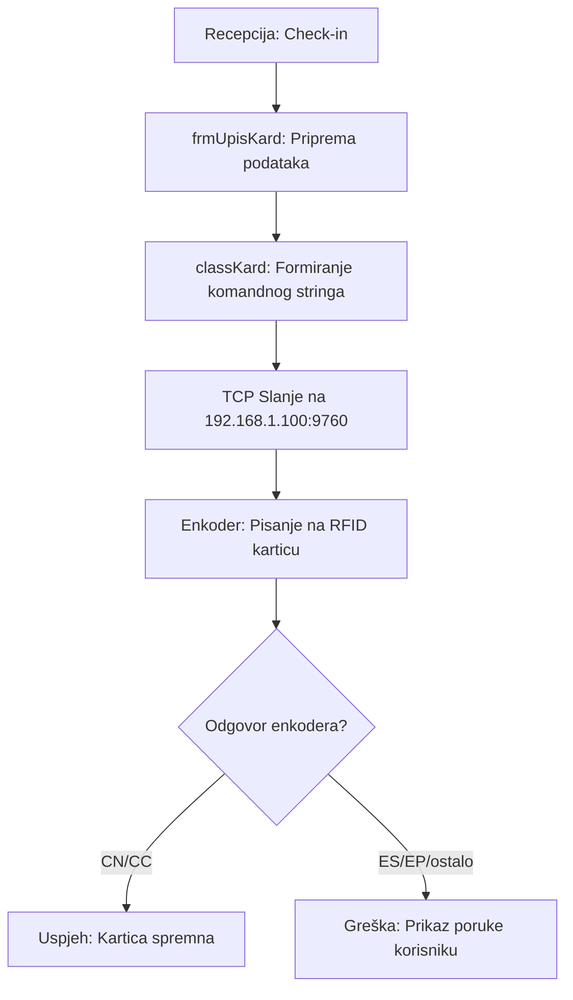

# FSD 11: Hardver Integracije (RFID i Kontroleri)

## Status analize
- **Fajlovi za analizu:** `classKard.vb`, `frmUpisKard.vb`
- **Tabele za analizu:** `logcont`, `sobe` (polje `idkon`)
- **Status:** AUTHORITATIVE
- **Analizirao:** 2026-05-15 - Antigravity (Claude Sonnet 3.5)

## 1. Pregled modula
Ovaj modul je odgovoran za direktnu komunikaciju sa hardverskim komponentama hotela: RFID enkoderima kartica i kontrolerima za otključavanje vrata. Sistem koristi TCP/IP protokol (Winsock) za slanje instrukcija enkoderu. Ključna funkcija je kodiranje kartica za goste sa ograničenim vremenskim trajanjem i pristupom određenim sobama.

## 2. Workflow dijagrami

### 2.1 Proces kodiranja kartice za gosta


## 3. Tehnički detalji protokola

### 3.1 Format komandnog stringa
Sistem koristi specifičan ASCII format za komunikaciju:
- **Header**: `Chr(2)` (STX)
- **Separator**: `Chr(179)`
- **Sadržaj**: `comanda`, `kol`, `motorised`, `soba`, `soba2`, `soba3`, `soba4`, `aGranted`, `aDenied`, `sTime`, `eTime`, `radnik`, `tr1Gost`, `tr2`, `tr3`, `serial`
- **Footer**: `Chr(3)` (ETX) + `Chr(13)` (CR)

### 3.2 Ključni parametri kartice
- **Sobe**: Podržava do 4 sobe po jednoj kartici (`soba`, `soba2`, `soba3`, `soba4`).
- **Vrijeme**: `sTime` (Start) i `eTime` (End). Kartica prestaje raditi čim prođe `eTime` (vrijeme check-outa).
- **Tipovi kartica**: Gost, Sobarica (`LM`), Rezervna (`LR`).

## 4. Poslovna pravila (Business Rules)

### 4.1 Validacija Check-out vremena
- Kartica se kodira tačno do vremena check-outa dogovorenog u Modulu 3 i 4. Ovo sprečava goste da ulaze u sobu nakon isteka boravka.

### 4.2 Statusi enkodera
Sistem rigorozno prati odgovore enkodera:
- `OV (Overflow)`: Enkoder je zauzet, korisnik mora sačekati 10 sekundi.
- `EO`: Kartica je kodirana na drugom sistemu i mora biti "obrisana" ili "poništena" prije ponovne upotrebe.
- `EA`: Soba je odjavljena u bazi enkodera, nemoguće je dodati karticu dok se ne sinhronizuje.

### 4.3 Logiranje pristupa
- Svaki uspješan ulazak u sobu kontroler šalje nazad u bazu, što se upisuje u tabelu `logcont`. Ovo omogućava recepciji da vidi da li je gost ušao u sobu ili kada je sobarica bila u sobi.

## 5. Edge case-ovi i posebni slučajevi
- **Rezervna kartica (`LR`)**: Izdavanje dodatne kartice ako gost izgubi prvu ili želi još jednu.
- **Master kartica**: Sobarice imaju pristup cijelim spratovima/zgradama.
- **Prekid komunikacije (`NC`)**: Ako mrežna veza sa enkoderom pukne, sistem mora obavijestiti korisnika da kartica NIJE kodirana iako je check-in u bazi možda uspio.

## 6. Otvorena pitanja (rije�ena)

### OQ-08-001: RFID enkoder
Hotel ima sopstveno vlasnicko rje�enje (proprietary C# kod). Enkoder je Mifare karticni reader/writer koji upisuje podatke u sektore kartice. Nije eksterni .exe fajl � integrisan je direktno u aplikaciju kroz klase `classKard.vb` i `kard_imedia.vb`.

### OQ-08-002: Mobilni kljuc (BLE)
NE � sistem ne treba podr�avati BLE mobilni kljuc.

### RS485 kontroler soba
- HTTP bridge: 1 bridge po hotelu (pooling za vi�e zgrada)
- Maksimalno 370 kontrolera soba na jednom RS485 busu
- Svi kontroleri su na jednom RS485 bus-u spojeni na jedan HTTP?RS485 bridge
- Bridge u sebi ima listu svih adresa i sam radi polling i transfer logova
- Default IP: 192.168.0.199, port 80 (konfigurabilno)
- Default MQTT port: 1883 (LAN), 8883 (TLS)

## 7. Mock driver za testiranje

Razvoj ne smije zavisiti od fizickog hardvera. Svaki interfejs mora imati mock implementaciju.

```csharp
// HotelPro.Hardware.Tests/Mocks/MockRoomControl.cs
public class MockRoomControl : IRoomControl
{
    private readonly Dictionary<string, RoomStatus> _rooms = new();

    public MockRoomControl()
    {
        // Inicijalno: sve sobe prazne, 20°C
        for (int i = 101; i <= 120; i++)
            _rooms[i.ToString()] = new RoomStatus
            {
                RoomId = i.ToString(), Temperature = 20,
                TargetTemperature = 22, IsOccupied = false
            };
    }

    public Task SetTemperatureAsync(string roomId, double temp, double hyst)
    {
        _rooms[roomId].TargetTemperature = temp;
        return Task.AUTHORITATIVETask;
    }

    public Task<RoomStatus> ReadStatusAsync(string roomId)
        => Task.FromResult(_rooms[roomId]);

    // Fire event za testiranje SOS alarma
    public void SimulateSos(string roomId)
        => OnSosAlarm?.Invoke(this,
            new RoomEvent { RoomId = roomId, Type = "SOS" });

    public event EventHandler<RoomEvent> OnSosAlarm;
    public event EventHandler<RoomEvent> OnFireAlarm;
}
```

Konfiguracija — u dev modu se koristi mock, u prod stvarni driver:
```json
{
  "Hardware": {
    "RoomControl": {
      "Driver": "dev" ? "Mock" : "LuxM.Http",
      "Settings": {}
    }
  }
}
```

## 8. Offline mod bridge-a

Legacy brave rade i bez servera (lokalni keš na kontroleru). Bridge mora podržavati isto.

### 8.1 Keširanje komandi
```csharp
public class OfflineCache
{
    private readonly Queue<MqttMessage> _pending = new();

    public void Enqueue(MqttMessage msg)
    {
        _pending.Enqueue(msg);
        // Perzistencija na disk (JSON file) — otpornost na restart
        File.AppendAllText("offline_cache.json", JsonSerializer.Serialize(msg));
    }

    public async Task FlushAsync(IMqttClient client)
    {
        while (_pending.TryDequeue(out var msg))
        {
            try
            {
                await client.PublishAsync(msg.Topic, msg.Payload);
            }
            catch
            {
                Enqueue(msg); // vrati u red
                break;        // sačekaj sledeći pokušaj
            }
        }
    }
}
```

### 8.2 Exponential backoff reconnection
```csharp
public class ReconnectionPolicy
{
    public async Task ReconnectAsync()
    {
        int attempt = 0;
        while (true)
        {
            try
            {
                await _mqtt.ConnectAsync();
                await _cache.FlushAsync(_mqtt);
                break;  // uspješno
            }
            catch
            {
                attempt++;
                var delay = Math.Min(1000 * Math.Pow(2, attempt), 300_000);
                await Task.Delay((int)delay);
            }
        }
    }
}
```

## 9. Webhook sistem za integracije

Za Channel Manager, POS, Payment Gateway i druge eksterne sisteme.

```csharp
public interface IWebhookPublisher
{
    Task PublishAsync(string eventType, object payload);
}

// Implementacija: HTTP POST na registrovane endpoint-e
public class WebhookPublisher : IWebhookPublisher
{
    public async Task PublishAsync(string eventType, object payload)
    {
        var subscribers = await _db.WebhookSubscriptions
            .Where(s => s.EventType == eventType && s.Active)
            .ToListAsync();

        foreach (var sub in subscribers)
        {
            await _http.PostAsJsonAsync(sub.Url, new WebhookPayload
            {
                Event = eventType,
                HotelId = _currentHotel.Id,
                Timestamp = DateTime.UtcNow,
                Data = payload
            });
        }
    }
}
```

Predefinisani eventi:
```
booking.created      → Channel Manager (Booking.com, Airbnb)
booking.cancelled    → Channel Manager
booking.modified     → Channel Manager
checkin.AUTHORITATIVE    → POS, Housekeeping
checkout.AUTHORITATIVE   → POS, Payment Gateway
payment.received     → Payment Gateway
room.status.changed  → Housekeeping
rate.plan.updated    → Revenue Management
```

## 10. Preporuke za novi sistem
- **Abstraction Layer**: Kreirati hardverski agnostičan sloj (Driver pattern) tako da se u budućnosti lako mogu dodati novi modeli enkodera ili BLE brave.
- **Real-time Status Dashboard**: Vizuelni prikaz statusa svih kontrolera (online/offline) u realnom vremenu.
- **Fail-safe Logic**: Implementirati lokalni keš na kontrolerima (ako već ne postoji) tako da brave rade i u slučaju pada centralne mreže.
- **Mobile Key Integration**: Nadograditi sistem za slanje digitalnih ključeva direktno na telefone gostiju.
- **Mock driveri**: Svaki interfejs mora imati mock za development bez hardvera.
- **Offline cache**: Bridge mora keširati komande dok konekcija ne bude ponovo uspostavljena.
- **Webhooks**: Eksterni sistemi se integrišu preko webhook-ova, ne direktnim pristupom bazi.
