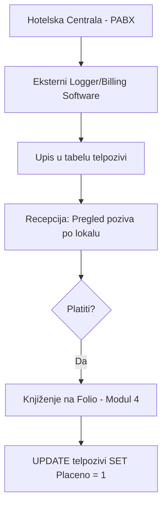

# FSD 12: Telefonska Centrala (PABX Integracija)

## Status analize
- **Fajlovi za analizu:** `frmTarifaPozivi.vb`, `frmTarifaPoziviNovo.vb`
- **Tabele za analizu:** `telpozivi`, `telpozivi_stara`, `telefonskiimenik`
- **Status:** AUTHORITATIVE
- **Analizirao:** 2026-05-15 - Antigravity (Claude Sonnet 3.5)

## 1. Pregled modula
Modul Telefonska Centrala služi za automatsko evidentiranje i tarifiranje telefonskih poziva obavljenih iz hotelskih soba. Sistem prepoznaje lokal (ekstenziju) sobe, destinaciju, trajanje poziva i na osnovu definisanih tarifa obračunava trošak koji se kasnije može knjižiti na folio gosta.

## 2. Workflow dijagrami

### 2.1 Proces obrade poziva

## 3. Entiteti i tabele (legacy → novi)

| Legacy (MySQL) | Opis | Novi entitet (PostgreSQL) | Napomena |
|:---|:---|:---|:---|
| `telpozivi` | Dnevnik svih poziva | `PhoneCall` | |
| `telefonskiimenik` | Interni imenik hotela | `PhoneDirectory` | |
| `telpozivi_stara` | Arhiva poziva | `PhoneCallArchive` | |

### 3.1 Detalji tabele `telpozivi`
- `Lokal`: Broj telefona u sobi (povezano sa `sobe.lokal`).
- `TelefonskiBroj`: Pozvani broj (destinacija).
- `TrajanjePoziva`: Dužina trajanja (obično u formatu MM:SS ili sekundama).
- `Cijena`: Obračunata vrednost poziva.
- `Placeno`: Flag (1 = plaćeno/proknjiženo, 0 = otvoreno).

## 4. Poslovna pravila (Business Rules)

### 4.1 Mapiranje lokala na sobu
- Svaka soba u tabeli `sobe` ima polje `lokal`. Kada centrala pošalje podatak o pozivu sa lokala "101", sistem ga automatski vezuje za sobu koja ima taj lokal.

### 4.2 Tarifiranje
- Sistem podržava definisanje tarifa po destinacijama (nacionalni, međunarodni, mobilni pozivi).
- Postoji arhiva poziva (`telpozivi_stara`) što sugeriše periodično čišćenje glavne tabele radi performansi.

### 4.3 Knjiženje na račun
- Pozivi koji nisu označeni kao `Placeno` se prikazuju recepcioneru prilikom odjave gosta kako bi se dodali na finalni račun.

## 5. Edge case-ovi i posebni slučajevi
- **Nepoznati lokali**: Pozivi sa lokala koji nisu dodeljeni nijednoj sobi (npr. recepcija, kancelarije). Ovi pozivi se obično ne tarifiraju gostima.
- **Dugi pozivi**: Pozivi koji traju preko ponoći (retko, ali moguće).
- **Besplatni pozivi**: Lokalni pozivi unutar hotela ili hitne službe koji imaju cenu 0.

## 6. Otvorena pitanja (rije�ena)

### OQ-07-001: telpozivi podaci
U legacy kodu se mora nalaziti serial driver koji cita podatke sa telefonske centrale (slicno kao RFID enkoder � direktna serijska komunikacija, ne eksterni middleware).

### OQ-07-002: Wake-up call
Potrebno provjeriti da li je ovo rije�eno u legacy kodu ili treba nova implementacija.

## 7. Preporuke za novi sistem
- **IP-PBX Integracija**: Novi sistem bi trebao direktno komunicirati sa modernim IP centralama (npr. Asterisk, 3CX) putem API-ja ili Webhook-ova.
- **Real-time Posting**: Čim se poziv završi, trošak bi se trebao automatski pojaviti na digitalnom foliu gosta.
- **Wake-up Call Interface**: Integrisati komandu za buđenje direktno u PMS, koja šalje instrukciju centrali da pozove sobu u određeno vreme.
- **Phone Directory App**: Omogućiti pretragu internog imenika putem digitalnog panela ili QR koda u sobi.
